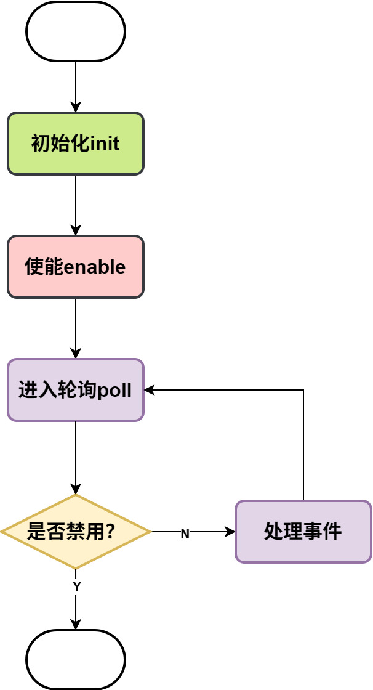
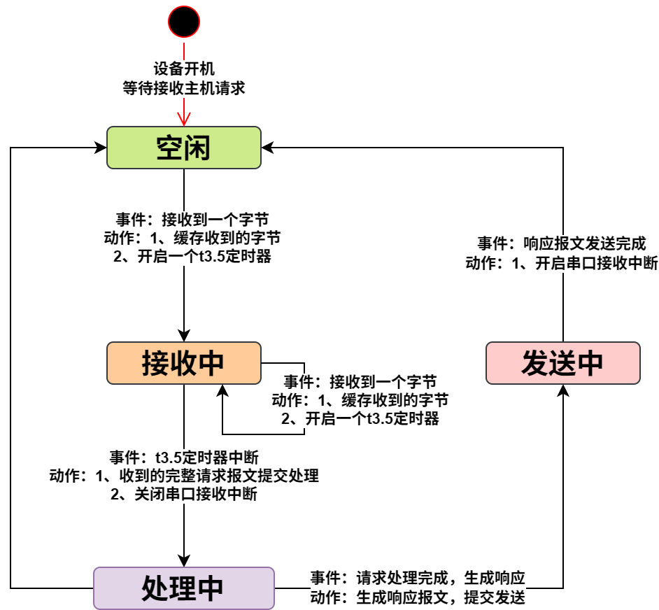

#### 从机

##### 启动流程

##### 工作原理

基于有限状态机（FSM）实现，从机的整体状态流转如下图：

#### 编码原则

1. 定时器、串口中断的回调处理，要尽量简短

#### 测试软件

1. modbus poll，可测试从机的实现
2. modbus slave，可测试主机的实现
3. Device Monitoring Studio，串口通信数据抓包

#### 参考资料

1. MODBUS over serial line specification and implementation guide V1.02
2. MODBUS APPLICATION PROTOCOL SPECIFICATION V1.1b3
3. 代码实现参考：https://www.embedded-experts.at/en/freemodbus-downloads/